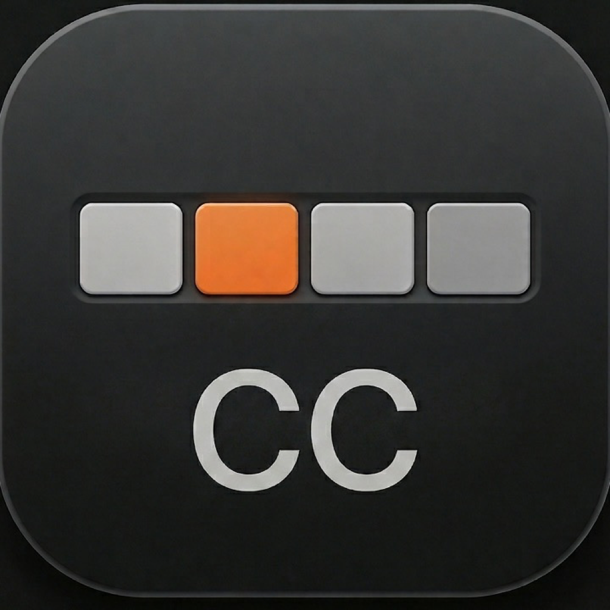
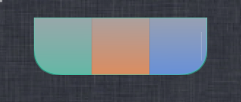

<p align="center">
  
</p>

<h1 align="center">CCBar</h1>

<p align="center">
  <strong>Claude Code,装进你的菜单栏。</strong><br>
  原生 macOS 菜单栏 app:实时会话状态、5h 用量上限、Token / Cost 统计、权限审批气泡。
</p>

<p align="center">
  <a href="https://github.com/Rladmsrl/ccbar/releases/latest"></a>
  
  <a href="LICENSE"></a>
</p>

<p align="center">
  <a href="#features">Features</a> ·
  <a href="#install">Install</a> ·
  <a href="#build-from-source">Build From Source</a> ·
  <a href="#acknowledgements">Acknowledgements</a>
</p>

<p align="center">
  <a href="https://github.com/Rladmsrl/ccbar/releases/latest"><strong>⬇️ 下载最新版</strong></a>
</p>

---

## Features

CCBar 从你本地的 `~/.claude/` 里读 Claude Code 的会话记录,把那些藏在终端和 JSON 里的状态,变成抬眼一瞥就懂的东西。它不替你写代码 —— 它替你盯着 Claude,给那些同时开着好几个会话、一天要瞄几十次用量的重度用户。

### 菜单栏:一眼看完今天还剩多少额度


当前 5h 窗口的剩余时间和用量百分比,常驻在你菜单栏的最上面。不用点开任何窗口,扫一眼就知道还能跑多久、要不要悠着点。

标签里显示什么、按什么顺序排、什么时候自动藏起来,全都能拖着配成你最顺手的样子;还能跟 Claude Code 的 statusLine 双向桥接 —— 终端里和菜单栏里,看到的是同一份数据。

### 悬浮标签:把"几个 Claude 正在跑"钉在屏幕边上



同时开三五个会话时,最烦的就是不知道哪个在等你、哪个早跑完了。Floating Tab 把所有会话压成屏幕边缘的一条分段色带 —— **一段就是一个会话,颜色直接告诉你它的状态**:在跑、空闲、等你批权限、还是已经收工。

### 还有这些,顺手就在

- **权限审批气泡** —— Claude 卡在"要不要批准"时,从悬浮标签直接弹个气泡,Allow / Deny / Always 一点就同步回 chat;可配全局快捷键(在别的 app 前台也按得动)、提示音、勿扰
- **Token / Cost 统计** —— 按 (message.id, requestId) 跨 session 去重,不会像上游那样把 cost 算翻倍;成本口径、算不算 cache 都能切
- **API / 配置切换台** —— 一键换 provider(base URL / key / 模型),管理多套配置 profile,顺手浏览编辑 AGENTS.md / CLAUDE.md / plans,还能做个 CLI 环境体检
- **Skills 库** —— 本地 + plugin skills 一览,接得上 skills.sh
- **Git 仓库活动** —— 本地仓库的提交图、语言 / SLOC、代码归属
- **AI 活动时间线** —— 把你在编辑器里的活动和 Claude 的活动叠在一条轴上对比(读本机 Screen Time)
- **Claude 服务状态** —— 盯着 claude.ai / Claude Code 在不在线,出问题可选系统通知

## Install

从 [Releases](https://github.com/Rladmsrl/ccbar/releases/latest) 下载最新包。第一次打开如果被 Gatekeeper 拦住,右键 ▸ **打开**。

## Privacy & Data

CCBar 是 **local-first**:核心统计来自 `~/.claude/projects/` 的本地会话日志,不上传任何使用数据。

可选权限,用到才申请:
- **Full Disk Access** —— 读取 `~/.claude/` 完整目录(Sonoma+ 上某些路径需要)
- **自动化 / Apple Events** —— 点 Focus 时用 AppleScript 把对应终端标签页切到前台
- **辅助功能 / 输入监听** —— 仅当你开启「全局快捷键」让 Allow / Deny 在任意 app 前台都生效时才需要
- **Network access** —— 三种情况会联网:看 Claude 服务状态(拉官方 status 页)、在 Skills 页同步 skills.sh、检查应用更新(Sparkle appcast)

**API key 存储**:在 Switcher 里切换 provider 时,API key **默认存进 macOS 钥匙串**。只有当你显式选「JSON」存储模式时,key 才会以**明文**写进 `~/.claude/settings.json`(Claude Code 原生读取的位置)和 CCBar 的 `providers.json`(文件权限已锁到仅本人可读)。

CCBar 内置 [Sparkle](https://sparkle-project.org) 自动更新,默认开启后台静默检查,也能在 **设置 ▸ 关于 ▸ Check for Updates…** 手动检查。每次推一个 `v*.*.*` tag,发版工作流就构建并打包,发一个带 DMG/zip 的 GitHub Release,再 EdDSA 签名、把更新后的 `appcast.xml` 推到本仓库 `gh-pages`(GitHub Pages serve 在 `SUFeedURL`),已安装的 app 据此自动更新。

## Build From Source

```bash
git clone https://github.com/Rladmsrl/ccbar.git
cd ccbar
brew install xcodegen
bash scripts/run-debug.sh   # 生成 + Debug 构建 + 启动菜单栏 app
bash scripts/run-tests.sh   # 跑单元测试
```

`ClaudeStats.xcodeproj` 由 [`project.yml`](project.yml) + [XcodeGen](https://github.com/yonaskolb/XcodeGen) 生成,不入库。改动 `project.yml` 后跑 `bash scripts/generate.sh` 重新生成。详细的开发约定见 [`CLAUDE.md`](CLAUDE.md)。

### Requirements

- macOS 14+
- Xcode 26+,Swift 6 strict concurrency mode
- XcodeGen

### Project Layout

```
ClaudeStats/
  App/          @main 入口、AppEnvironment、Info.plist、entitlements
  Models/       Sendable value types
  Providers/    Provider 协议 + Claude Code 实现(目前唯一 provider)
  Services/     扫描器、解析器、SessionRegistry、统计聚合
  ViewModels/   @MainActor @Observable 视图模型
  Views/
    FloatingStats/   可拖浮窗、Permission Bubble、状态色覆盖层
    Sessions/        实时会话列表 / 详情
    Usage/           Token / Cost / 5h 用量上限
    Activity/        AI 活动时间线
    Git/             仓库活动
    MainWindow/      主窗口
    Install/         statusLine bridge 安装向导
  Pricing/         模型价目数据(JSON)
  Localization/    Localizable.xcstrings(中英双语)
  Resources/       App resources
  Utilities/       Logger、formatter、共享 helpers
ClaudeStatsTests/  解析、扫描、设置、集成测试
docs/assets/       README 图
scripts/           generate.sh / run-debug.sh / run-tests.sh
```

## Contributing

欢迎 issue 和 PR。提 PR 前请跑 `bash scripts/run-tests.sh`;涉及 app 行为改动的再跑 `bash scripts/run-debug.sh`。保持 Swift 6 strict concurrency 零警告。

## Acknowledgements

CCBar 站在两个开源项目的肩膀上:[**1pitaph/claude-stats**](https://github.com/1pitaph/claude-stats)（UI 样式、统计视图骨架与整体视觉体系 —— CCBar 是它的下游 fork,继承 AGPL-3.0）与 [**rullerzhou-afk/clawd-on-desk**](https://github.com/rullerzhou-afk/clawd-on-desk)（「agent 状态实时映射到桌面」+「权限审批气泡」的核心思路）。

## License

[GNU Affero General Public License v3.0](LICENSE) —— 继承自上游 `1pitaph/claude-stats`。

任何衍生作品必须保持开源且采用 AGPL-3.0。如果你 fork 了 CCBar 并提供网络服务,你也需要把修改过的源码对你的用户开放。
